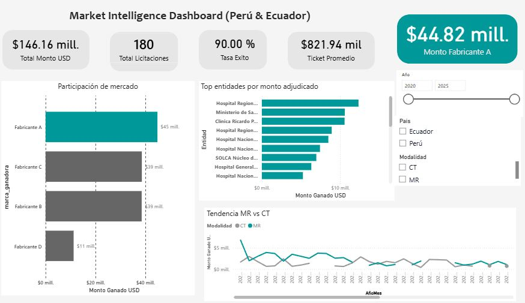
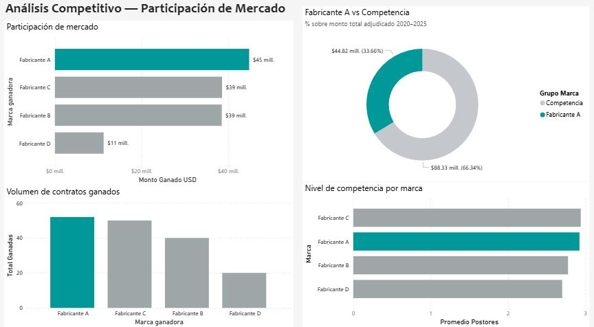

# Análisis de Mercado — Equipos de Imagen Médica (MR & CT)
### Licitaciones Públicas: Perú (SEACE) & Ecuador (SERCOP) | 2020–2025

> **Contexto académico:** Proyecto desarrollado en el marco del curso de Proyectos de Inversión Pública (UNMSM). Analiza datos reales de procesos de adquisición pública de equipos de imagen médica (MR y CT) para identificar tendencias de mercado, patrones de compra y posicionamiento competitivo de los principales fabricantes en la región.

🔗 **[Ver dashboard en Power BI]([https://app.powerbi.com/TU-LINK-AQUI](https://app.powerbi.com/groups/me/reports/0c3bee40-5bfe-4530-8ae2-a0c9532a7501?ctid=717b9a79-1b91-41ab-a6f7-a579b46a9b41&pbi_source=linkShare))**

---

## Dashboard

### Página 1 — Market Intelligence Overview


*KPIs principales: monto total adjudicado, número de licitaciones, tasa de éxito y ticket promedio. Filtros por año, país y modalidad (MR/CT).*

### Página 2 — Análisis Competitivo


*Participación de mercado por fabricante (USD adjudicado), volumen de contratos ganados y nivel de competencia promedio por licitación.*

---

## Hallazgos principales (2020–2025)

| Métrica | Valor |
|---|---|
| Total licitaciones analizadas | 180 |
| Monto total adjudicado | ~$146M USD |
| Tasa de adjudicación | 90% |
| Ticket promedio por contrato | ~$822K USD |
| Países | Perú, Ecuador |
| Tipos de equipo | MRI 1.5T, MRI 3T, CT 64/128/256 cortes |

- El fabricante líder concentra **~33% del monto adjudicado** en la región
- La modalidad **CT representa mayor volumen** de licitaciones; MR tiene mayor ticket promedio
- **Lima y Pichincha** concentran la mayor inversión por región
- Tasa de adjudicación del **90%** — mercado activo con baja tasa de procesos desiertos

---

## Estructura del repositorio

```
seace-imaging-market-analysis/
├── generate_dataset.py          # Pipeline Python: genera dataset basado en patrones SEACE/SERCOP
├── build_excel_dashboard.py     # Genera workbook Excel con formato profesional
├── data/
│   └── licitaciones_mr_ct.xlsx  # Dataset limpio (180 registros, listo para Power BI)
├── assets/
│   ├── dashboard_page1.png      # Captura Página 1 — Market Intelligence
│   └── dashboard_page2.png      # Captura Página 2 — Análisis Competitivo
└── README.md
```

---

## Stack técnico

| Herramienta | Uso |
|---|---|
| Python + pandas | Generación y limpieza del dataset |
| openpyxl | Formato profesional del workbook Excel |
| Power BI Desktop | Modelado de datos y visualizaciones |
| Power BI Service | Publicación y sharing del dashboard |
| SEACE / SERCOP | Fuentes de datos públicas (OCDS) |

---

## Cómo reproducir

```bash
# 1. Instalar dependencias
pip install pandas openpyxl numpy

# 2. Generar dataset
python generate_dataset.py
# Output: data/licitaciones_mr_ct.xlsx

# 3. Generar Excel con formato
python build_excel_dashboard.py
# Output: data/MR_CT_Market_Analysis.xlsx

# 4. Conectar en Power BI Desktop
# Obtener datos → Excel → seleccionar hoja "Datos_Licitaciones"
```

---

## Fuentes de datos reales

Para reemplazar el dataset simulado con datos reales:

**Perú — SEACE (OSCE):**
```
https://contratacionesabiertas.osce.gob.pe/
Palabras clave: "resonancia magnética", "tomógrafo", "equipo de imagen médica"
Formato: CSV / XLSX
```

**Ecuador — SERCOP:**
```
https://datosabiertos.compraspublicas.gob.ec/PLATAFORMA/datos-abiertos
Filtro: "equipos médicos", "imagenología"
Formato: CSV / JSON
```

Reemplazar el archivo `data/licitaciones_mr_ct.xlsx` (hoja `Datos_Licitaciones`) manteniendo los mismos nombres de columna.

---

## Habilidades demostradas

- Análisis de datos de contratación pública (estándar OCDS — Perú & Ecuador)
- Market intelligence para equipos de imagen médica
- Pipeline de datos en Python (pandas, openpyxl)
- Modelado y visualización en Power BI (DAX, slicers, medidas calculadas)
- Diseño de dashboards ejecutivos para soporte a decisiones comerciales
- Conocimiento técnico: MRI (campo magnético, modalidades), CT (cortes, protocolos)
- Conocimiento del proceso de licitación pública SEACE / SERCOP

---

*Proyecto académico — Joselyn Romero Avila · Ingeniería Biomédica, UNMSM · Curso: Proyectos de Inversión Pública*
